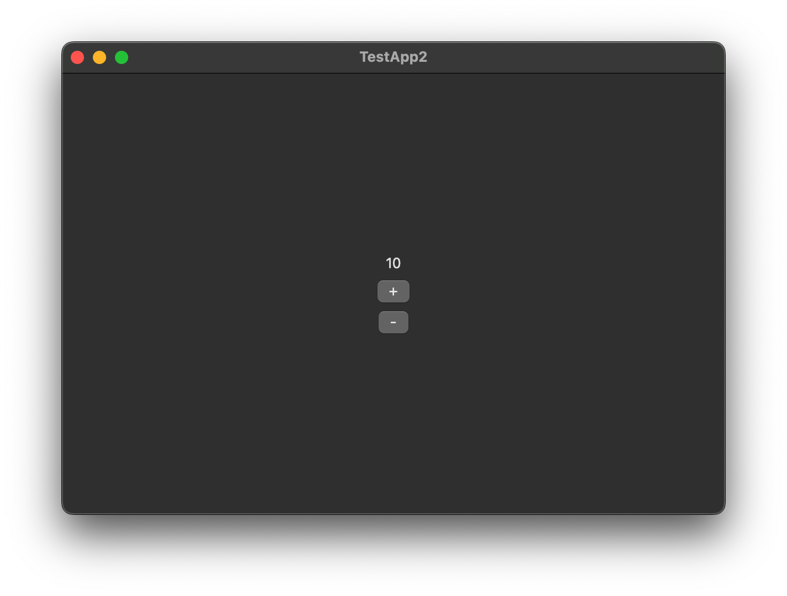

After [creating a new Poly project](/guides/creating-project),
let's create a counter app as a gentle introduction to Poly.
In this guide, we will use [TypeScript](https://www.typescriptlang.org) to create the app, using the `poly` and the `poly-widgets` TypeScript library.

## The Main File

Before writing any code, let's have a look at the main file `src/main.ts`.
When building the binary of the portable layer, this main file is fed into the compiler.
Then, the compiler produces a single binary that is spawned by the native layer when running the app,
which runs the `main` function defined in the main file. Now, let's go through the `main` function.

### The Context Object

The first point of interest is the following snippet

```ts
const context = createApplication({
  messageChannel: new StdioMessageChannel({
    async *stdin() {
      for await (const chunk of process.stdin) {
        yield chunk;
      }
    },
    async stdout(data: Uint8Array) {
      await process.stdout.write(data);
    },
  }),
});
```

The `createApplication` function, exported by `poly/application`, creates a context object that stores all the runtime information of the application,
such as created views and registered callbacks.
Pass this `context` to any Poly API that asks for a context object.

An instance of `StdioMessageChannel` is used as the channel between the portable layer and the native layer for exchanging messages.
In order to be runtime independent, the constructor asks for an implementation of `stdin` and `stdout`.
`stdin` expects an async generator which yields the bytes received from the stdin pipe of the process.
`stdout` is an async function that writes the given bytes to the stdout pipe of the process.
In this case, we are using the `process` API of Node.JS to exchange data through the stdio.

You can adjust the implementations to the JavaScript runtime in which you wish to run the portable layer.
For example, in [Bun](https://bun.sh), you would write the following:

```ts
new StdioMessageChannel({
  async *stdin() {
    for await (const chunk of Bun.stdin.stream()) {
      yield Uint8Array.from(chunk);
    }
  },
  async stdout(data: Uint8Array) {
    await Bun.write(Bun.stdout, data);
  },
})
```

:::danger
Poly only supports running the portable layer with Node.JS at the moment!
:::

### The Application Instance

After creating the context object, it is used to start the application:

```ts
const instance = runApplication(context);
```

The `runApplication` function, also exported by `poly/application`,
returns a `Promise` that will awaited at the end of the `main` function to keep the application alive.

### Initializing Widgets

After running the application, the TypeScript widget library, `poly-widgets`, must be initialized before the widgets are usable.

```ts
initializeWidgets(context);
```

### Application Logic

In between awaiting the instance and the call to `runApplication` is where the application logic resides,
such as drawing the UI and creating windows.
In this case of creating the counter app, this is where the UI of the counter and the logic of the counter sits.

By default, the `main` function creates an empty window that has the application name as its title:

```ts
createWindow(
  {
    title: "TestApp2",
    description: "A Poly application written in TypeScript.",
    width: 600,
    height: 400,
    tag: "main",
  },
  context,
);
```

The `tag` is a handle to the window.
It is useful, for example, when specifying where to display the created widgets, which we will get into later on this page.
**It must be unique amongst all the windows created by the application.**

:::caution
Do not await any top-level function call here, even though you may be calling an awaitable function!

```ts {"Do not await getUsers here:":9-10}
// src/main.ts
import { getUsers } from "./api.js"

async function main() {
  // ...
  const instance = runApplication(context)
  
  createWindow(...)
  
  getUsers()
  
  await instance
}
```

```ts {"await is OK inside the async function:":3-4}
// src/api.ts
async function getUsers(): Promise<User[]> {

  const response = await fetch("https://api.com/users")
  return response.json()
}

export { getUsers }
```
:::

### Keeping the Application Alive

Finally, this line:

```ts
await instance
```

keeps the application run loop alive.

## Making the Counter UI



The counter UI consists of three elements: the current count, the increment button, and the decrement button, all inside a column in order.

Let's define a function called `counterScreen` that encapsulates the UI code and the logic of manipulating and keeping track of the count. Create a new file called `counter-screen.ts` next to `main.ts`:

```ts
// src/counter-screen.ts
import { type ApplicationContext } from "poly/application"
import { type Widget } from "poly-widgets"

function counterScreen(context: ApplicationContext): Widget {
  // TODO: implement me
}

export { counterScreen }
```

Since we need the context object in the screen, the function is defined with the `context` parameter whose type, exported by `poly/application`, is `ApplicationContext`. The function returns the UI tree which we will use later in the main function and which we are going to define now.

### Defining the UI tree

`poly-widgets` exports a variety of widgets that can be composed together to form the UI:

```ts ins={4-9,14-34} del={13}
// src/counter-screen.ts
import { type ApplicationContext } from "poly/application"
import {
  type Widget,
  FILL_PARENT,
  Alignment,
  column,
  text,
  button
} from "poly-widgets"

function counterScreen(context: ApplicationContext): Widget {
  // TODO: implement me
  return center(
    column(
      [
        text("0", {}),
        button("+", {
          context,
          onClick: () => {},
        }),
        button("-", {
          context,
          onClick: () => {},
        }),
      ],
      {
        width: FILL_PARENT,
        height: FILL_PARENT,
        horizontalAlignment: Alignment.CENTER,
        verticalAlignment: Alignment.CENTER,
      },
    ),
  );
}

export { counterScreen }
```

Below lists all the widgets used:

- `center` centers its child widget horizontally and vertically relative to its parent. In this case, its parent is the window itself, so it will center the column relative to the window.
- `column` aligns its children in a column in order of appearance in the array. In the code abovce, `FILL_PARENT` is specified for its width and height, which tells it to use as much space as its parent allows. `Alignment.CENTER` is set for the column's horizontal and vertical alignment, which will center the column's children horizontally and vertically relative to the column.
- `button` creates a platform-aware button. For example, on macOS, it will be a native AppKit button. On Linux, it will be a GTK button. noop is used as the `onClick` callback in the code above as a placeholder.


### Modifying the Counter

When the increment button is clicked, the counter needs to be increment, and the counter text needs to be updated. We can do that through the `onClick` callback:

```ts ins={7,36,41} ins={"Stores the counter:":14-15} ins={"Generates a new tag for the counter label:":16-17} ins={"Button callbacks:":18-27} ins="tag: counterTextTag" del={35,40}
// src/counter-screen.ts
import { type ApplicationContext } from "poly/application"
import {
  type Widget,
  FILL_PARENT,
  Alignment,
  updateWidget,
  column,
  text,
  button,
} from "poly-widgets"

function counterScreen(context: ApplicationContext): Widget {

  let count = 0
  
  const counterTextTag = context.idRegistry.newId("text");
  
  function incrementCounter() {
    count += 1
    updateWidget(counterTextTag, text(`${count}`, {}), context)
  }
  
  function decrementCounter() {
    count -= 1
    updateWidget(counterTextTag, text(`${count}`, {}), context)
  }

  return center(
    column(
      [
        text("0", { tag: counterTextTag }),
        button("+", {
          context,
          onClick: () => {},
          onClick: incrementCounter,
        }),
        button("-", {
          context,
          onClick: () => {},
          onClick: decrementCounter,
        }),
      ],
      {
        width: FILL_PARENT,
        height: FILL_PARENT,
        horizontalAlignment: Alignment.CENTER,
        verticalAlignment: Alignment.CENTER,
      },
    ),
  );
}
```

We use `context.idRegistry.newId` to create a new, **unique** ID for the `text` widget that displays the current count.
The ID is  used to identify the instance of text that should be updated.
Without the ID, Poly will not be able to know the correct `text` to update!

Now, when the increment button is clicked, `incrementCounter` is called, which increases the `count` variable by one and updates the counter text with the new count.
When the decrement button is clicked, `decrementCounter` is called, which decreases the `count` variable by one and updates the counter text accordingly.

### Showing the Counter Screen

Now that we have created the counter screen, let's import it in the main file and display it:

```ts ins={6,36-39} ins=" createWidget "
// src/main.ts
import { createApplication, runApplication } from "poly/application";
import { StdioMessageChannel } from "poly/bridge";
import { createWindow } from "poly/window";
import { initializeWidgets, createWidget } from "poly-widgets";
import { counterScreen } from "./counter-screen.js";

async function main() {
  const context = createApplication({
    messageChannel: new StdioMessageChannel({
      async *stdin() {
        for await (const chunk of process.stdin) {
          yield chunk
        }
      },
      async stdout(data: Uint8Array) {
        await process.stdin.write(data);
      },
    }),
  });

  const instance = runApplication(context);

  initializeWidgets(context);

  createWindow(
    {
      title: "TestApp2",
      description: "A Poly application written in TypeScript.",
      width: 600,
      height: 400,
      tag: "main",
    },
    context,
  );

  const screen = counterScreen(context);

  createWidget(screen, "main", context);

  await instance;
  
}

main()
```

The `screen` variable holds the widget tree returned by `counterScreen`. It is then passed to `createWidget` which instructs Poly to draw the widget tree in the window tagged `"main"`.

## Running the Application

We have finished creating the counter! Before running the application, we need to compile the TypeScript code first:

```shell
pnpm run build
```

This generates a binary named `bundle` in `<project-name>/build`:

```diff
MyNewApp/
├── gtk/
│   ├── packaging/
│   │   ├── rpm/
│   │   │   └── app.spec
│   │   └── launch.sh
│   ├── src/
│   │   └── main.cxx
│   └── CMakeLists.txt
├── macOS/
│   ├── MyNewApp/
│   │   ├── AppDelegate.swift
│   │   └── main.swift
│   ├── MyNewApp.xcodeproj
│   └── project.yml
+├── build/
│   └── bundle
└── app/
    ├── src/
    │   └── main.ts
    ├── package.json
    └── tsconfig.json
```

Now, open the `.xcodeproj` file in the `macOS` folder in XCode. Wait for XCode to finish building the project, then hit the Run button.

That's it! You have successfully created your first Poly application with TypeScript.