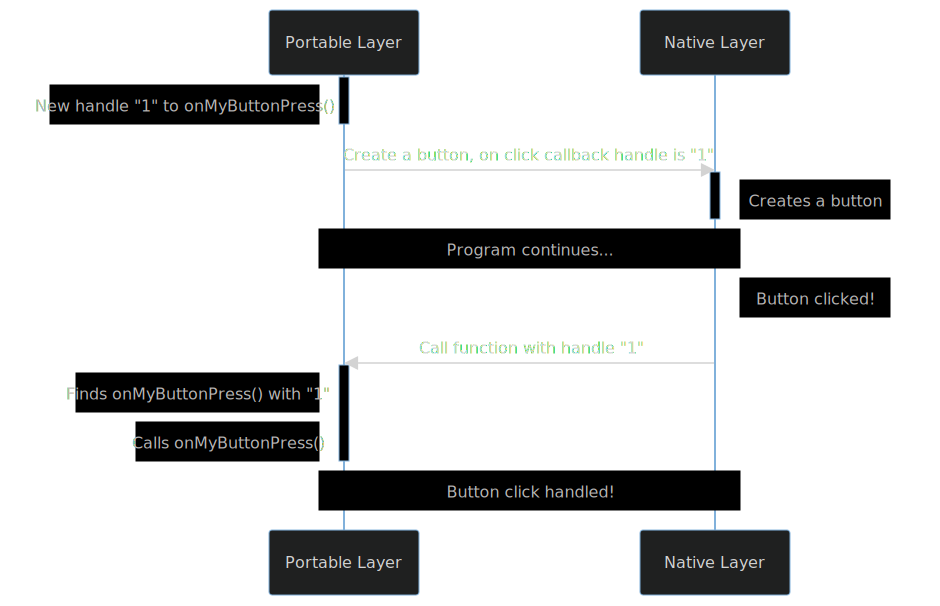
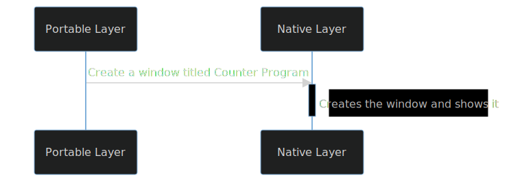

A Poly application consists of two layers: the **portable layer**, and the **native layer**.  The portable layer contains all the application logic that is portable across operating systems, while the native layer handles the native functionality, including drawing the UI. The two layers pass messages to each other in order to exchange data. The portable layer runs in a separate process that is spawned by the native layer, and the two layers exchange messages through the standard IO.

:::note
Theoretically, the two layers can exchange messages through other mediums such as WebSocket or HTTP.
This may prove to be useful in the future.
:::

This two-layer message-passing architecture allows Poly to abstract common native functionalities, such as widget drawing,
into a portable interface that the native layer implements.
The portable layer does not need to know _how_ the interface is implemented by the native layer, so long as it is correctly implemented; vice versa.
This interface can be seen as an RPC (Remote Procedural Call) interface, and will be described in detail in this document.
This abstraction is what enables the following important features of Poly:

- language agnosticism;
- true native applications; and
- application development with one codebase.

## Message Format

Both layers need to speak the same "language" in order for them to communicate.
Poly uses a custom-developed message format called [NanoPack](/nanopack/introduction/), which is a lightweight binary serialization format.
Similar to [Protocol Buffers](https://protobuf.dev), messages in NanoPack are structured data that are defined in schema files.
Then, a compiler compiles the schema files into language-specific code (think classes in Java) that enables creation of messages
and means to serialize and deserialize the messages to and from raw bytes.

:::note
This guide will describe the shape of the messages in YAML, but NanoPack messages are in binary, NOT in YAML.
:::

## Callbacks

Function callback is a common way to delegate UI event handling, such as when a button is pressed.
In Poly, callbacks between two layers are achieved by exchanging _function handles_ which are just plain integers.

For each callback, a unique _handle_ is created that only the layer that creates it can recognize
For example, if the portable layer wants a function named `onMyButtonClick` to be called whenever a button is clicked,
it will first generate a unique handle for `onMyButtonClick`. Then, the handle will be passed to the native layer when creating the button.
When the native layer detects that the button is clicked, it will notify the portable layer of the click event, and also pass along the handle.
Once the portable layer receives the event, it will find the function reference using the handle, and then call the function.



## A Counter Program

Consider a Poly application that is just a simple counter program.
The UI consists of three widgets: the current count in a text view, and two buttons for incrementing and decrementing the count.

Let's step through the lifecycle of the program together!

### Program Launch

When the program is launched, the native layer is first initialized, which is just an AppKit app, or a Gtk program, depending on the OS.
At the same time, the portable layer is also spawned in a child process.

### Creating a Window

After both layers are initialized, the portable layer will request a new window to be drawn.
It does so by sending a NanoPack-formatted message to the native layer.

```yaml
CreateWindow:
  title: My Counter
  tag: main
  width: 600
  height: 400
```

This instructs the native layer to create a new window titled "My Counter" that is 400px in height and 600px in width.



After receiving the message, the native layer will then create a new window with the requested spec and displays it.

### Drawing the UI

Promptly after requesting to create the window, the portable layer will request to draw the UI
by sending a description of the UI to the native layer.

```yaml
CreateWidget:
  windowTag: main
  widget:
    Center:
      child:
        Column:
          children:
            Text:
              tag: count
              content: 0
            Button:
              content: Increment
              callbackHandle: 1
            Button:
              content: Decrement
              callbackHandle: 2
```

This instructs the native layer to draw the widgets in the window with the tag `main`.
Since the text is tagged with the string "count", it will store a reference to the text widget for future use.


After receiving the message, the native layer will draw the widgets in the destined window.
Now, the window will contain:

- the current count, which is 0
- a button that says "Increment"; and
- a button that says "Decrement".

### Updating the count

Because the counting logic is handled at the portable layer, it is responsible for keeping tracking of the current count,
modifying it, and requesting to have the displayed count updated.

Let's suppose the "Increment" button is clicked. The native layer will first notify the portable layer of the click event,
by sending the callback handle of the button to the portable layer and requesting the portable layer to invoke it.

```yaml
InvokeCallback:
  handle: 1
```

Once the portable layer receives the message, it will find the function reference that has the handle "1", and then invoke it.
In the callback, the internal counter kept by the portable layer will be incremented, from 0 to 1.
Then, a request to update the counter text will be made to the native layer.

```yaml
UpdateWidget:
  tag: count
  widget:
    Text:
      content: 1
```

The given `tag` lets the native layer know which instance of the widget should be updated.
The `widget` field tells the native layer what information it should update the widget with.
In this case, the content of the text widget tagged with `"count"` will have its content changed to `"1"` (from `"0"`) by the native layer.


The same process happens when the "Decrement" button is clicked.

### Conclusion

Since the portable layer does not import any OS-specific library or framework, the code for it only needs to be written once.
The counter logic only needs to be implemented once in one programming language, and it will work the same way on all the supported OSes.
Same goes for the native layer - it does not matter what technology it is using under the hood, AppKit, WinUI, Gtk, etc.,
as long as it is able to understand the requests from the portable layer and behave correctly.
This dual layer architecture is what enables the flexibility of Poly.
